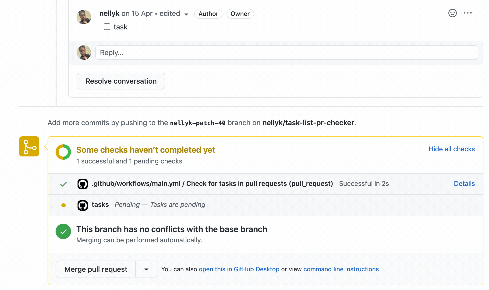

# Task Status Pull Request Checker

>This is triggered when a pull request is created. If the pull request has pending tasks. The pull request won't be merged and the status is updated on the pull request checks.

## 👩‍💻 Hiring 👨‍💻

> Want to get paid for your contributions to `actions`?
> Send your resume to oneamex.careers@aexp.com

## 📖 Table of Contents

* [Actions](#-actions)
* [License](#%EF%B8%8F-license)
* [Code Of Conduct](#%EF%B8%8F-code-of-conduct)
* [Contributing](#-contributing)

### How to enable this action

1. Create a [github workflow](https://help.github.com/en/actions/configuring-and-managing-workflows/configuring-a-workflow) in your repository and add the below.

```yaml
 on:
  pull_request:
    types:
      - opened
      - edited
  pull_request_review_comment:
    types:
      - created
      - deleted
      - edited
  issue_comment:
    types:
      - created
      - deleted
      - edited
jobs:
  task_checker:
    runs-on: ubuntu-latest
    name: Check for tasks in pull requests
    steps:
      - name: Pull request task checker
        uses: americanexpress/task-status-pr-checker@v1
        with:
          GITHUB_TOKEN: '${{ secrets.GITHUB_TOKEN }}'
 ```

1. Tasks




## 🗝️ License

Any contributions made under this project will be governed by the [Apache License
2.0](./LICENSE).

## 🗣️ Code of Conduct

This project adheres to the [American Express Community Guidelines](./CODE_OF_CONDUCT.md).
By participating, you are expected to honor these guidelines.

## 🏆 Contributing

We welcome Your interest in the American Express Open Source Community on Github.
Any Contributor to any Open Source Project managed by the American Express Open
Source Community must accept and sign an Agreement indicating agreement to the
terms below. Except for the rights granted in this Agreement to American Express
and to recipients of software distributed by American Express, You reserve all
right, title, and interest, if any, in and to Your Contributions. Please [fill
out the Agreement](https://cla-assistant.io/americanexpress/).

Please feel free to open pull requests and see [CONTRIBUTING.md](./CONTRIBUTING.md) to learn how to get started contributing.
